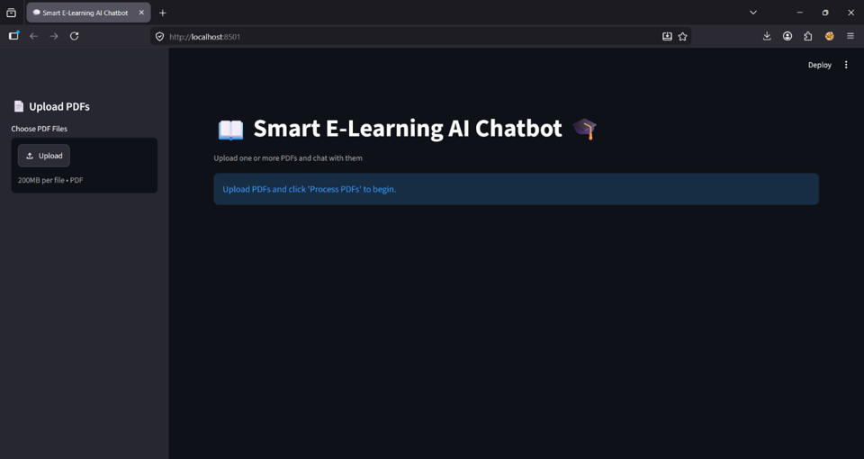
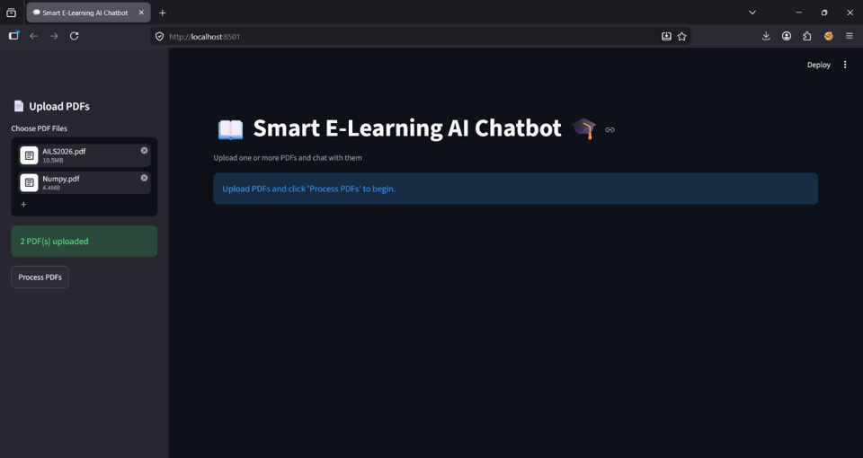
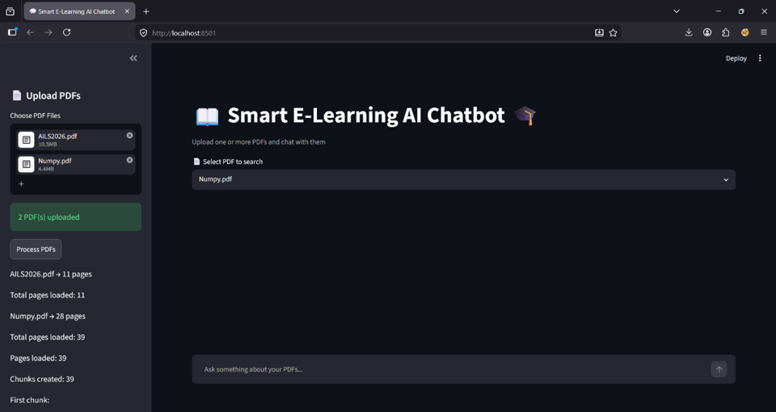
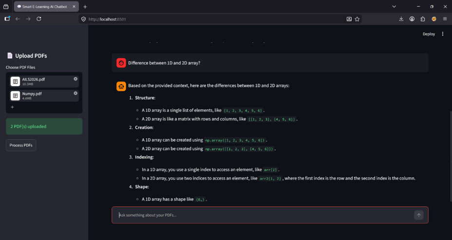
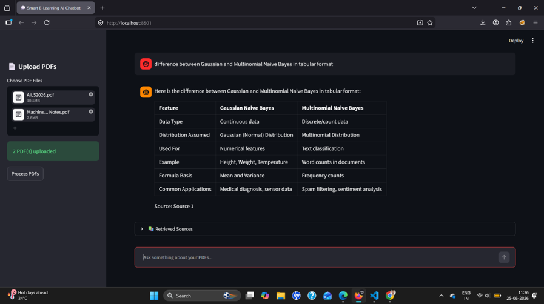
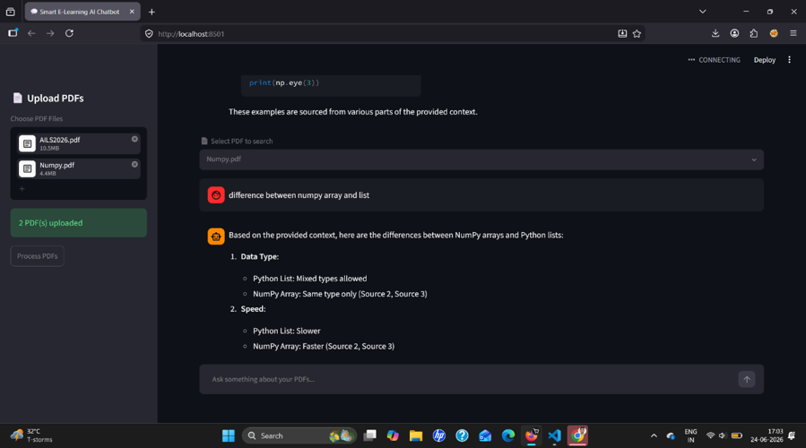
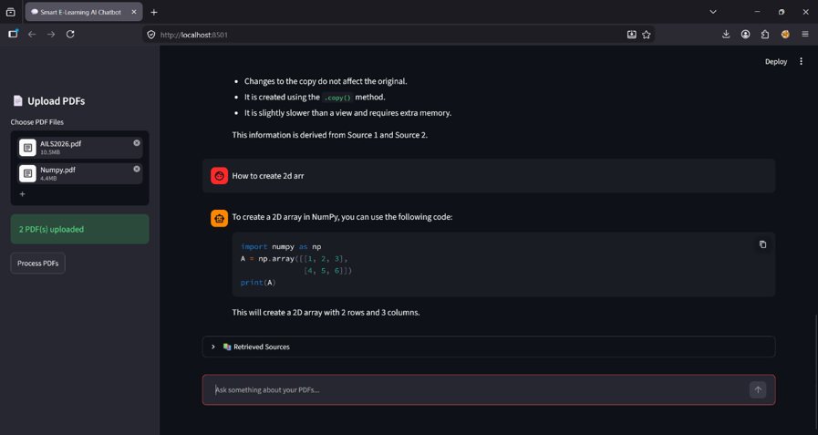

# 📘 Smart E-Learning AI Chatbot

An AI-powered PDF question-answering system based on **Retrieval-Augmented Generation (RAG)**. The application allows users to upload educational PDF documents and ask questions about their contents using natural language.

The system retrieves relevant information from the uploaded documents using semantic search and then uses a Large Language Model to generate a context-aware response.

---

## ✨ Features

- 📄 Upload one or multiple PDF documents
- 💬 Ask questions using natural language
- 🔎 Semantic search using document embeddings
- 🧠 Retrieval-Augmented Generation (RAG)
- 📚 Context-aware document question answering
- 🔀 Maximum Marginal Relevance (MMR) retrieval
- 🗂️ Select a specific PDF for searching
- 📌 Display source document and page information
- 📝 Support for definitions, summaries, technical questions, and comparisons
- 🌐 Interactive Streamlit web interface
- 💾 Local vector storage using ChromaDB

---

## 🧩 Example

Suppose an uploaded PDF contains separate explanations of **1D and 2D arrays in NumPy**.

The user can ask:

> What is the difference between 1D array and 2D array in NumPy?

The PDF does not need to contain this exact question. The system retrieves the relevant sections describing both concepts and generates a structured comparison from the retrieved information.

This demonstrates how RAG can combine information from different parts of a document to answer a new, context-related question.

---

## 🏗️ RAG Workflow

```text
User Uploads PDF
       ↓
PyPDFLoader
       ↓
Text Extraction
       ↓
Recursive Character Text Splitter
       ↓
Text Chunks
       ↓
HuggingFace Embeddings
(all-MiniLM-L6-v2)
       ↓
ChromaDB
       ↓
User Question
       ↓
Semantic Retrieval
       ↓
MMR Retriever
       ↓
Relevant Document Chunks
       ↓
Prompt + Retrieved Context
       ↓
Mistral Small
       ↓
Generated Answer
       ↓
Streamlit Chat Interface

---

## 🛠️ Technology Stack

Component	Technology
Programming Language	Python 3.11
User Interface	Streamlit
RAG Framework	LangChain
PDF Processing	PyPDF / PyPDFLoader
Text Splitting	RecursiveCharacterTextSplitter
Embedding Model	HuggingFace all-MiniLM-L6-v2
Vector Database	ChromaDB
Language Model	Mistral Small (mistral-small-2603)
Environment Management	python-dotenv


## 📁 Project Structure
AI-E-Learning-Assistant/
│
├── app.py                  # Main Streamlit application
├── main.py                 # CLI-based RAG chatbot
├── create_database.py      # Vector database creation
├── test_pdf.py             # PDF testing utility
├── requirements.txt        # Python dependencies
├── README.md               # Project documentation
├── .gitignore              # Git ignored files
├── .env.example            # Environment variable template
│
├── pdf/                    # Input/sample PDF documents
├── chroma-db/              # Generated vector database
└── venv/                   # Python virtual environment

venv/, .env, and generated chroma-db/ files should not be uploaded to GitHub.

## ⚙️ Requirements

Before running the project, make sure you have:

Python 3.11
Git
A Mistral API key
Internet connection

Python 3.11 was used as the development environment for this project.

## 🚀 Installation
1. Clone the repository
git clone https://github.com/Ritom18/AI-E-Learning-Assistant.git

Move into the project directory:

cd AI-E-Learning-Assistant
2. Create a virtual environment

On Windows:

python -m venv venv

Activate the environment:

.\venv\Scripts\Activate.ps1

If required, you can also use:

venv\Scripts\activate
3. Install dependencies
pip install -r requirements.txt

## 🔐 Configure the Mistral API Key

Create a file named:

.env

in the project root directory.

Add:

MISTRAL_API_KEY=your_api_key_here

The repository contains .env.example as a template:

MISTRAL_API_KEY=your_api_key_here

## ⚠️ Security

Never upload your actual .env file or API key to GitHub.

Do not place a real API key inside:

.env.example
README.md
Python source files
screenshots
GitHub commits

If an API key is accidentally exposed, revoke it immediately and create a new one.

## ▶️ Run the Application

Make sure the virtual environment is activated.

Run:

python -m streamlit run app.py

The application will normally open at:

http://localhost:8501

## 📄 How to Use
Step 1 — Upload PDFs

Use the Upload PDFs section to select one or more educational PDF documents.

Step 2 — Process PDFs

Click:

Process PDFs

The application:

Extracts text from the PDFs
Splits the text into smaller chunks
Generates embeddings
Stores the embeddings in ChromaDB
Step 3 — Select a PDF

If multiple PDFs are uploaded, select the PDF you want to search.

Step 4 — Ask a Question

Enter your question in the chatbot.

Examples:

What is NumPy?
What is broadcasting in NumPy?
What is a 1D array?
Summarize the uploaded PDF.
What is the difference between 1D array and 2D array in NumPy?

##🔎 Retrieval Configuration

The chatbot uses Maximum Marginal Relevance (MMR) for document retrieval.

The current configuration is:

search_kwargs={
    "k": 5,
    "fetch_k": 15,
    "lambda_mult": 0.5
}
Parameter Explanation
Parameter	Value	Purpose
k	5	Number of final chunks retrieved
fetch_k	15	Number of candidate chunks considered
lambda_mult	0.5	Balance between relevance and diversity

MMR helps prevent the retriever from returning several nearly identical chunks and instead attempts to provide complementary information.

## 🧠 How the RAG System Works

The system consists of two main stages.

1. Retrieval

When the user asks a question, the query is converted into an embedding.

ChromaDB compares the query embedding with the stored document embeddings and retrieves semantically relevant chunks.

The MMR retriever then selects a diverse set of relevant chunks.

2. Generation

The retrieved document content is combined with the user's question.

This context is sent to the Mistral language model, which generates the final response.

Therefore, the chatbot can answer questions using information retrieved from the uploaded documents rather than depending only on the model's general knowledge.

## 🧪 Example Query Types
Query Type	Example
Definition	What is NumPy?
Summary	Summarize the uploaded PDF.
Information Retrieval	Who are the convenors of AILS 2026?
Technical Concept	What is broadcasting in NumPy?
PDF-specific Question	What is a 1D array?
Comparative Reasoning	What is the difference between 1D and 2D arrays?
Multi-PDF Search	Search information from the selected PDF.

## 📊 Evaluation

The chatbot was tested using educational and technical PDF documents.

The evaluation considered:

Relevance of retrieved information
Quality of generated answers
Technical concept understanding
PDF summarization
Comparative question answering
Multi-document interaction
Source document and page information
Comparative Question Example

A notable test was:

What is the difference between 1D array and 2D array in NumPy?

The source PDF contained information about 1D and 2D arrays separately. The chatbot retrieved the relevant sections and generated a structured comparison.

This shows that the system can combine information from multiple retrieved passages to answer a question that is related to the document but is not necessarily written in the document in exactly the same form.

## 🖥️ Screenshots

### Home Page of the Smart E-Learning AI Chatbot



*Fig. 1. Home page of the Smart E-Learning AI Chatbot.*

### Uploading Multiple PDF Documents



*Fig. 2. Uploading Multiple PDF Documents.*

### Processed PDF Documents Ready for Querying



*Fig. 3. Processed PDF Documents Ready for Querying.*

### Chatbot Generating an Answer from the Uploaded PDF



*Fig. 4. Chatbot Generating an Answer from the Uploaded PDF.*

### Chatbot Generating an Answer from the Another Uploaded PDF



*Fig. 5. Chatbot Generating an Answer from the Another PDF.*

### Chatbot Generating an Answer from the Another Uploaded PDF



*Fig. 6. Chatbot Generating an Answer from the Another PDF.*

### Chatbot Generating an Answer from the Different Uploaded PDF



*Fig. 7. Chatbot Generating an Answer from the Different PDF.*


## ⚠️ Limitations

The current version has some limitations:

Mainly designed for text-based PDF documents
Scanned PDFs may require OCR
Answer quality depends on the quality of the source documents
Very large documents may require additional optimization
Mistral API availability and rate limits can affect response generation
The current application is primarily designed for local/individual use

## 🔮 Future Improvements

Possible future improvements include:

🔊 Voice-based question answering
🌍 Multilingual question answering
📷 OCR support for scanned documents
🖼️ Multimodal retrieval for text, tables, and images
📝 Automatic quiz generation
📊 Learning analytics
☁️ Cloud deployment
👥 Multi-user support
📌 Improved source highlighting
💾 Chat history and conversation management
🎓 Project Highlights

This project demonstrates the practical use of:

Retrieval-Augmented Generation
Natural Language Processing
Semantic Search
Vector Databases
Large Language Models
Document Question Answering
Conversational AI
Generative AI
Python
Streamlit

## 📜 License

This project is released under the MIT License.

👤 Author

Ritom Chakraborty

M.Sc. Computer Science (Data Science)

## Areas of Interest
Data Science
Machine Learning
Natural Language Processing
Generative AI
Retrieval-Augmented Generation
Document Intelligence

## ⭐ If you find this project useful, consider giving the repository a star.
